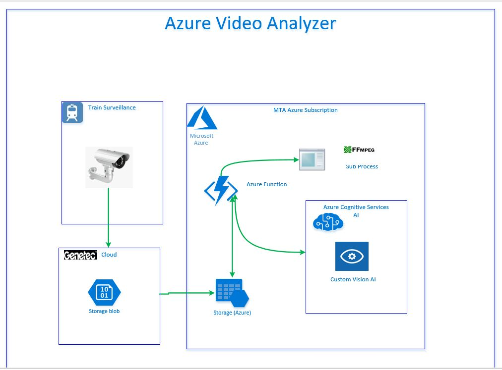

Azure function - Video Analysis using FFMPEG tool

# How it works?

- Azure function has been created to listen to the Blob container for the incoming video files. 
- As soon as MTA Train's survilliance video file arrives in to the Blob container, Azure function picks it up.
- Azure function download the incoming video file into the temporary workspace. 
- Invokes the **FMPEG** tool to encode the video file and extract the image frames 
- Encoded image frames are fed into the pre trained Custom vision Azure Cognitive service
- Based on the trained model, the Custom Vision will determine number human faces visible in the image. 
- Results are stored in the Blob container **filename_result.json** in JSON format

